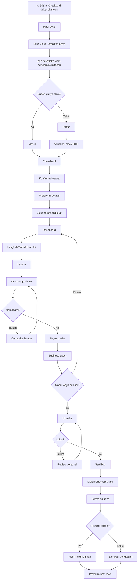

# PRODUCT REQUIREMENTS DOCUMENT
# DekatLokal Platform V2 — Ruang Tumbuh UMKM

**Status:** Product and Frontend PRD v2.0  
**Primary domain:** `app.dekatlokal.com`  
**Connected public site:** `dekatlokal.com`  
**Primary experience:** Mobile-first responsive web application  
**Initial delivery:** High-fidelity frontend demo with mock data  
**Future data layer:** Neon Postgres  
**Language:** Bahasa Indonesia  
**Primary audience:** Pemilik dan pengelola UMKM Indonesia  

---

## 1. Executive Summary

DekatLokal Platform V2 adalah evolusi dari Digital Checkup menjadi sistem pendampingan UMKM yang personal, terarah, dan terukur.

Website utama `dekatlokal.com` tetap menjadi pintu masuk publik untuk mengenal program, mengisi Digital Checkup, melihat layanan, partner, galeri, dan informasi program. Setelah pengguna memperoleh hasil Digital Checkup, pengguna diarahkan ke `app.dekatlokal.com` untuk membuat akun atau masuk.

Hasil Digital Checkup otomatis menjadi dasar penyusunan pengalaman pengguna. Beranda tidak menampilkan katalog course yang acak. Sistem hanya menampilkan prioritas yang relevan, satu langkah terbaik berikutnya, alasan rekomendasi, estimasi waktu, dan hasil usaha yang akan dibuat.

### Product thesis

> DekatLokal bukan tempat mencari course. DekatLokal adalah pendamping digital yang memahami kondisi usaha, menentukan langkah paling penting, membantu pemilik menerapkannya, dan membuktikan perkembangan usahanya.

### Siklus produk

```text
Digital Checkup
→ Klaim hasil
→ Jalur personal
→ Belajar singkat
→ Praktik pada usaha
→ Unggah bukti
→ Uji pemahaman
→ Dapatkan aset usaha
→ Digital Checkup ulang
→ Lihat perkembangan
→ Klaim reward
→ Lanjut ke tingkat berikutnya
```

### Diferensiasi utama

1. Rekomendasi berasal dari data usaha, bukan katalog umum.
2. Setiap modul menghasilkan output usaha.
3. Pengguna hanya melihat langkah yang relevan.
4. Materi gratis tetap memberi hasil nyata.
5. Progress mengukur tindakan dan perkembangan usaha.
6. Aset dari pembelajaran digunakan kembali untuk landing page.
7. UI dan komunikasi menyesuaikan kenyamanan digital pengguna.
8. Pendamping Tekap hadir secara kontekstual.
9. Digital Checkup ulang menunjukkan perubahan sebelum–sesudah.
10. Platform tetap satu ekosistem visual dengan `dekatlokal.com`.

---

## 2. Hubungan dengan Website Utama

### 2.1 Peran `dekatlokal.com`

- Brand homepage.
- Akuisisi pengguna.
- Digital Checkup tanpa login.
- Hasil awal dan CTA.
- Program, partner, galeri, sebaran wilayah.
- Artikel dan SEO.
- Showcase website UMKM.
- Kebijakan publik.

### 2.2 Peran `app.dekatlokal.com`

- Login dan signup.
- Claim hasil checkup.
- Profil pemilik dan usaha.
- Dashboard personal.
- Jalur intervensi.
- Learning experience.
- Progress dan performa.
- Sertifikat.
- Checkup ulang.
- Reward.
- Premium learning.
- Notifikasi dan bantuan.

### 2.3 Prinsip transisi

Pengguna tidak boleh merasa berpindah ke produk lain.

Kesamaan wajib:

- Logo.
- Primary blue.
- Tipografi.
- Tone of voice.
- Ikonografi.
- Gaya ilustrasi.
- Radius dan shadow family.
- Terminologi.
- Header identitas DekatLokal.

Perbedaan yang diperbolehkan:

- Aplikasi lebih fokus dan minim navigasi publik.
- Mobile menggunakan bottom navigation.
- Komponen lebih interaktif.
- Informasi tampil secara progresif.
- Area login tidak perlu mengulang seluruh konten marketing.

---

## 3. Problem Statement

Pelaku UMKM sering menghadapi:

- Tidak tahu aspek usaha mana yang harus dibenahi lebih dahulu.
- Course terlalu umum.
- Materi panjang dan sulit diterapkan.
- Banyak pilihan menyebabkan kebingungan.
- Progress hanya dihitung dari video yang ditonton.
- Tidak ada bukti perubahan usaha.
- Harus mengisi data berulang ketika mengikuti program.
- Platform terasa teknis atau menggurui.
- Pengguna dengan kenyamanan digital rendah mudah berhenti.
- Pendamping sulit memantau perkembangan banyak UMKM.

DekatLokal sudah memiliki keunggulan awal: Digital Checkup memetakan kondisi usaha sebelum pengguna belajar. V2 harus mengubah data tersebut menjadi tindakan personal.

---

## 4. Goals

### 4.1 Product goals

- Mengubah hasil checkup menjadi personalized intervention plan.
- Mengurangi decision fatigue.
- Meningkatkan penyelesaian modul dasar.
- Mengubah learning completion menjadi business action.
- Membentuk Business Asset Bank.
- Membuat perkembangan terlihat dan dapat dibagikan.
- Menyiapkan reward landing page.
- Membuka jalur monetisasi premium yang relevan.
- Menyiapkan data untuk dashboard admin/partner pada fase berikutnya.

### 4.2 User experience goals

Pengguna harus dapat:

- Memahami kondisi usaha dalam 60 detik.
- Menemukan next action dalam 10 detik.
- Memulai/lanjut dalam satu tap.
- Menyelesaikan lesson dalam 3–8 menit.
- Menyelesaikan modul dalam sesi pendek.
- Memahami alasan rekomendasi dan lock.
- Menyimpan progress walau keluar aplikasi.
- Melihat hasil usaha yang sudah dibuat.
- Mengetahui syarat checkup ulang dan reward.

### 4.3 Business goals

- Membuktikan dampak program DekatLokal.
- Meningkatkan retensi pengguna.
- Mengurangi pendampingan manual yang repetitif.
- Meningkatkan kualitas data UMKM.
- Menjadi infrastructure pembinaan UMKM yang dapat digunakan partner.
- Menghasilkan premium conversion secara etis.

---

## 5. Non-goals pada Demo

Demo awal tidak mencakup:

- OTP WhatsApp produksi.
- Auth produksi.
- Payment gateway.
- Live AI coach.
- Live mentor review.
- Upload ke cloud storage produksi.
- PDF certificate server-side.
- Public certificate verification.
- Admin CMS lengkap.
- Integrasi crawling media sosial.
- Fuzzy AHP–TOPSIS produksi.
- Database production traffic.

Semua flow harus tersedia sebagai UI dan mock behavior.

---

## 6. Personas

### Persona A — Guided UMKM Owner

- Menggunakan Android.
- Nyaman dengan WhatsApp, belum terbiasa dashboard.
- Membutuhkan tombol besar.
- Lebih suka panduan langkah demi langkah.
- Waktu belajar tidak konsisten.
- Memerlukan reassurance.

### Persona B — Active Digital Owner

- Aktif di Instagram/TikTok/marketplace.
- Cepat memahami UI.
- Tidak suka materi terlalu dasar.
- Memerlukan quick wins dan template.

### Persona C — Business Helper

- Anak, staf, atau keluarga pemilik.
- Mengerjakan tugas digital.
- Membutuhkan kolaborasi tanpa mengambil kepemilikan.

### Persona D — Pendamping

- Memantau kelompok UMKM.
- Membutuhkan visibility terhadap progress.
- Fase dashboard pendamping berada di luar MVP user-facing.

---

## 7. Adaptive Experience

Personalisasi tidak boleh hanya berdasarkan umur. Input yang digunakan:

- Usia sebagai konteks opsional.
- Digital comfort.
- Ukuran teks.
- Waktu belajar.
- Format pilihan.
- Kecepatan belajar.
- Perangkat.
- Bahasa.
- Hasil checkup.
- Kategori usaha.
- Stage usaha.
- Aktivitas sebelumnya.

### Mode UI

#### Guided

- Instruksi lebih eksplisit.
- Satu task per layar.
- Ukuran teks besar opsional.
- Tekap lebih aktif.
- Konfirmasi sebelum tindakan penting.

#### Standard

- Informasi seimbang.
- Ringkasan dan detail tersedia.
- Bantuan kontekstual.

#### Fast

- Copy lebih ringkas.
- Test-out/skip optional bila memenuhi syarat.
- Lebih banyak shortcuts.
- Tetap menjaga dependency.

Struktur navigasi tetap sama agar pengalaman konsisten.

---

## 8. Information Architecture

### Public

```text
dekatlokal.com
├── /
├── /digital-checkup
├── /hasil-checkup/[resultId]
├── /program
├── /partner
├── /galeri
├── /artikel
└── /kebijakan
```

### App

```text
app.dekatlokal.com
├── /
├── /masuk
├── /daftar
├── /verifikasi
├── /hubungkan-checkup
├── /onboarding
└── /app
    ├── /beranda
    ├── /hasil-checkup
    ├── /jalur
    ├── /jalur/[planId]
    ├── /modul/[moduleSlug]
    ├── /belajar/[lessonId]
    ├── /kuis/[assessmentId]
    ├── /tugas/[taskId]
    ├── /hasil-modul/[moduleId]
    ├── /ujian-akhir
    ├── /progres
    ├── /aset-usaha
    ├── /sertifikat/[certificateId]
    ├── /checkup-ulang
    ├── /reward/landing-page
    ├── /premium
    ├── /notifikasi
    ├── /bantuan
    └── /akun
```

### Mobile navigation

1. Beranda
2. Jalur Saya
3. Progres
4. Akun

Tekap dan notifikasi bukan tab utama.

---

## 9. Core End-to-End Flow



---

## 10. Authentication and Claim Flow

### Primary login concept

1. WhatsApp number + OTP.
2. Google.
3. Email fallback.

Pada demo, semuanya mock.

### Claim object

```ts
type PendingCheckupClaim = {
  claimToken: string;
  resultId: string;
  source: "main_site";
  expiresAt: string;
  businessHint?: string;
};
```

### Production rules

- Token opaque.
- Signed and/or stored server-side.
- Single use.
- Short expiration.
- No scores in query string.
- Cannot be claimed by two accounts.
- Audit trail.
- Recovery through verified identity.

### Edge states

- Expired.
- Already claimed.
- No result.
- Business mismatch.
- Multiple results.
- Existing account.
- Interrupted signup.
- Offline.

---

## 11. Onboarding

Maximum five steps.

### 1. Personal welcome

> Halo, Bu Rina. Hasil Digital Checkup Warung Rina sudah siap. Produk Ibu sudah memiliki fondasi yang baik. Sekarang kita fokus agar usaha lebih mudah ditemukan dan menerima pesanan.

### 2. Business confirmation

- Name.
- Category.
- Location.
- WhatsApp.
- User role.
- Logo/photo.

### 3. Learning preference

- 5, 10, or 15 minutes.
- Video, audio, text, mixed.
- Guided, standard, fast.
- Standard/large text.

### 4. Preferred rhythm

- Morning.
- Afternoon.
- Evening.
- Flexible.
- Reminder opt-in.

### 5. Path reveal

- Priority.
- Why.
- Estimated commitment.
- First action.
- Reward preview.

CTA:

> Mulai Langkah Pertama

---

## 12. Personalization Engine V0

### Input

```ts
type PersonalizationInput = {
  checkup: {
    totalScore: number;
    pillarScores: Record<string, number>;
    criticalFlags: string[];
  };
  business: {
    category: string;
    stage: "starting" | "operating" | "growing";
    city?: string;
  };
  learner: {
    digitalComfort: "guided" | "standard" | "fast";
    dailyMinutes: 5 | 10 | 15;
    preferredFormats: string[];
    fontScale: "standard" | "large";
  };
};
```

### Priority factors

1. Need severity.
2. Dependency.
3. Expected business impact.
4. Quick-win potential.
5. Owner readiness.
6. Data completeness.
7. Prior learning history.

### Configurable bands

- `<50`: High priority.
- `50–69`: Medium priority.
- `70–84`: Reinforcement.
- `>=85`: Strong.

Threshold tidak boleh berada di UI component.

### Output

```ts
type InterventionPlan = {
  id: string;
  headline: string;
  summary: string;
  rationale: string;
  estimatedMinutes: number;
  steps: PlanStep[];
  nextBestAction: NextBestAction;
  rewardPreview?: RewardPreview;
};
```

---

## 13. Dashboard — Ruang Tumbuh

### First viewport

Wajib memuat:

1. Greeting.
2. Business identity.
3. Langkah Terbaik Hari Ini.
4. Why it matters.
5. Time estimate.
6. Primary CTA.

### Full order

1. Header.
2. Personal insight.
3. Next Best Action hero.
4. This week's path.
5. Progress.
6. Checkup summary.
7. Jejak Tumbuh.
8. Reward preview.
9. Tekap contextual message.

### Example

> **Buat Katalog WhatsApp Pertama**  
> 8 menit • Langkah 2 dari 5  
> Skor Kehadiran Digital Warung Rina masih 38/100. Katalog membantu pelanggan melihat produk tanpa bertanya satu per satu.

CTA:

> Lanjutkan 8 Menit

### State variants

- First visit.
- Continue lesson.
- Quiz due.
- Task due.
- Needs correction.
- Awaiting review.
- Final test available.
- Recheckup available.
- Reward available.
- Offline.
- Sync pending.

---

## 14. Digital Checkup Result

### Components

- Total score.
- Human interpretation.
- Strengths.
- Priorities.
- Pillar bars.
- Why each intervention is assigned.
- History.
- CTA.

### Language principles

Do not use:

- Bad.
- Failed.
- Left behind.
- Incapable.

Use:

- Belum optimal.
- Peluang penguatan.
- Prioritas berikutnya.
- Sudah menjadi fondasi.
- Dapat ditingkatkan.

---

## 15. Jalur Naik Kelas

### Path stages

1. Kenali kondisi.
2. Perkuat dasar.
3. Terapkan.
4. Buktikan.
5. Ukur perkembangan.
6. Naik kelas.

### Node states

- Locked.
- Available.
- In progress.
- Needs retry.
- Awaiting evidence.
- Awaiting review.
- Completed.

### Lock explanation

> Selesaikan “Deskripsi Usaha yang Jelas” terlebih dahulu. Hasilnya akan digunakan untuk membuat katalog WhatsApp.

Preview is allowed. Starting is blocked.

---

## 16. Module Model

### Module must include

- Outcome.
- Reason assigned.
- Lessons.
- Knowledge checks.
- Post-test.
- Action task.
- Asset generated.
- Completion rule.
- Badge.
- Follow-up review.

### Example

**Module:** Tampilkan Usaha di Google  
**Outcome:** Pelanggan dapat melihat lokasi, jam buka, foto, dan kontak.  
**Output:** Draft Google Business Profile data.  
**Completion:** Lessons complete + post-test pass + task submitted.

### Duration

- Lesson: 3–8 minutes.
- Module: 20–40 minutes.
- Can be split.
- Resume supported.

---

## 17. Learning Experience

### Lesson formula

1. Real problem.
2. Core concept.
3. Contextual example.
4. Interaction.
5. Business action.
6. Knowledge check.
7. Summary.

### Lesson types

- Story.
- Video.
- Audio.
- Short reading.
- Swipe comparison.
- Multiple choice.
- Sequence.
- Checklist.
- Template.
- Upload.
- Chat simulation.
- Voice reflection future.

### Rules

- One main concept per screen.
- No autoplay audio.
- Transcript.
- Low bandwidth option.
- Autosave.
- Fixed mobile CTA.
- Resume.
- Reduced motion.

---

## 18. Assessment and Mastery

### Knowledge check

- 1–3 questions.
- Immediate feedback.
- Explanation.

### Post-test

- 5–10 questions.
- Scenario based.
- Recommended pass score 80%.
- Unlimited retries without punishment.
- Failure creates corrective path.

### Corrective flow

- Show strong areas.
- Show weak areas.
- Assign only relevant micro-lessons.
- Retest targeted concepts.

### Final test

- Scenario.
- Mini project.
- Decision making.
- Path mastery.

---

## 19. Action Task

### Evidence types

- Checklist.
- Text.
- Link.
- Photo.
- Screenshot.
- File.
- Structured fields.

### Flow

1. Instruction.
2. Example.
3. Template.
4. Work area.
5. Save draft.
6. Preview.
7. Submit.
8. Review state.
9. Asset generated.

### Status

- Not started.
- Draft.
- Submitted.
- Needs revision.
- Approved.
- Auto-approved.

---

## 20. Business Asset Bank

All useful outputs are stored as assets:

- Business description.
- Product description.
- Price list.
- Logo.
- Product photos.
- Operational hours.
- Location.
- WhatsApp CTA.
- Instagram bio.
- Testimonial.
- Catalog.
- SOP.
- Google Profile data.
- Brand colors.
- Links.

### Uses

- Landing page reward.
- Future website builder.
- Checkup evidence.
- Progress timeline.
- Content templates.
- Mentor review.

This is a core moat: learning creates structured business data.

---

## 21. Progress — Jejak Tumbuh

### Show

- Learning completion.
- Action completion.
- Pillar scores.
- Before/after.
- Business assets.
- Timeline.
- Active days.
- Badge.

### Do not emphasize

- Watch time.
- Number of clicks.
- Public rank.
- Points without context.

### Example insight

> Kehadiran Digital meningkat 24 poin setelah katalog WhatsApp dan profil Google diselesaikan.

---

## 22. Digital Checkup Ulang

### Unlock

- Required path complete.
- Final test pass.
- Required tasks submitted/approved.
- Minimum time configurable.

### Result

- Previous score.
- New score.
- Changed answers.
- Contributing actions.
- New plan.
- Reward eligibility.

### Compare narrative

> Dalam 30 hari, Kehadiran Digital Warung Rina meningkat dari 38 menjadi 67. Perubahan terbesar berasal dari katalog WhatsApp dan profil Google.

---

## 23. Reward Landing Page

### Eligibility

- Basic path complete.
- Recheckup complete.
- Business profile complete.
- Required assets available.
- Terms accepted.
- Program capacity.

### Claim flow

1. Celebration.
2. Eligibility checklist.
3. Asset preview.
4. Missing asset resolution.
5. Choose style.
6. Submit.
7. Tracking.

### Tracking

- Waiting for data.
- Data complete.
- In production.
- Owner review.
- Live.

---

## 24. Premium Learning

### Principle

Free gives a usable foundation. Premium gives deeper strategy, mentoring, tools, and measurement.

### Examples

- Meta Ads.
- Local SEO.
- Marketplace optimization.
- CRM.
- Automation.
- Pricing.
- Financial management.
- Advanced branding.
- Analytics.
- Export readiness.

### Rules

- Personalized only.
- No aggressive marketplace.
- Show after prerequisites.
- Explain outcome and why relevant.
- Demo has no payment.

---

## 25. Gamification

### Terms

- Points → Poin Tumbuh.
- Streak → Langkah Beruntun.
- Achievement → Jejak Pencapaian.
- Quest → Misi Usaha.
- Levels → Mulai, Siap, Tumbuh, Naik Kelas.

### Award priority

Most points:

1. Business action.
2. Evidence.
3. Recheckup.
4. Mastery.
5. Lesson completion.

### Healthy streak

- Grace day.
- Recovery.
- No shame.
- No point loss for quiz failure.

### Badge examples

- Profil Usaha Siap.
- Produk Lebih Jelas.
- Brand Mulai Konsisten.
- Usaha Mudah Ditemukan.
- Order Lebih Rapi.
- Pelaku Usaha Konsisten.

No public leaderboard in MVP.

---

## 26. Differentiating Features

### 26.1 Business Twin

Examples use actual business name, category, products, and assets.

### 26.2 Next Best Action

One primary action every visit.

### 26.3 Action-to-Unlock

Progress depends on implementation, not watching.

### 26.4 Asset-to-Website

Learning output becomes landing page input.

### 26.5 Tekap Coach

Contextual guidance and escalation.

### 26.6 Growth Story

Shareable before/after narrative.

### 26.7 Recovery Path

Return after inactivity without restarting.

### 26.8 Team Mode

Owner delegates tasks to staff/family later.

### 26.9 Smart Reminder

Reminder respects business hours and preferences.

### 26.10 Localized Example Engine

Examples adapt by category and location.

### 26.11 Test-out

Fast users can prove competency and skip basics under controlled rules.

### 26.12 Mentor Escalation

Repeated difficulty triggers human support.

---

## 27. Content Strategy

### Tone

- Warm.
- Respectful.
- Clear.
- Practical.
- Optimistic.
- Non-judgmental.
- Not overly slang.
- Not academic.

### UI terminology

Use:

- Ruang Tumbuh.
- Jalur Naik Kelas.
- Langkah Terbaik Hari Ini.
- Jejak Tumbuh.
- Poin Tumbuh.
- Aset Usaha.
- Checkup ulang.

Avoid user-facing:

- Intervention.
- Remedial.
- LMS.
- Failed.
- Compliance.
- Funnel.

---

## 28. Visual and UX Direction

### Brand continuity

- Primary `#0255F5`.
- White and soft neutral background.
- Modern sans-serif.
- Rounded cards.
- Soft border.
- Controlled shadow.
- Strong whitespace.
- Limited gradient.
- Familiar copy from main site.

### Application evolution

- Bottom navigation.
- Progress visual.
- Interactive lesson components.
- Clear states.
- Fixed CTA.
- Thumb-friendly controls.

### Avoid

- Generic admin dashboard.
- Excessive glassmorphism.
- Neon colors unrelated to brand.
- Tiny text.
- Too many charts.
- Childish mascot overload.
- Large decorative animations.
- Course-card wall.

---

## 29. Mobile-first Requirements

- Primary frame: 390px.
- Minimum: 360px.
- Large mobile: 430px.
- Body at least 16px.
- Primary controls at least 44px.
- Safe area.
- No horizontal overflow.
- Fixed CTA not covering content.
- No hover dependence.
- Text scaling.
- Low bandwidth.

Desktop must be a purposeful responsive layout, not stretched mobile.

---

## 30. Accessibility

Target WCAG 2.2 AA:

- Keyboard access.
- Visible focus.
- Semantic HTML.
- Form labels.
- Error association.
- Contrast.
- Captions.
- Transcript.
- Reduced motion.
- No color-only meaning.
- Touch alternatives.
- Large text.
- Screen reader labels.
- Indonesian page language.

---

## 31. Reliability

- Local draft.
- Retry.
- Sync indicator.
- Offline banner.
- Idempotent submission.
- Compressed upload.
- Media fallback.
- Skeleton.
- Empty state.
- Error recovery.
- No data loss.

---

## 32. Demo Scenarios

### Scenario 1 — Guided culinary owner

- Warung Rina.
- Score 51.
- Low digital presence.
- Large text.
- 5-minute sessions.

### Scenario 2 — Fast fashion owner

- Saji Studio.
- Score 68.
- Good social media, weak operations.
- 10-minute sessions.
- Fast mode.

### Scenario 3 — Returning service business

- BersihPro Makassar.
- Score 74.
- Pending task.
- Recheckup near unlock.

### Required state simulator

Development-only selector changes scenario without editing code.

---

## 33. Analytics Events

- checkup_claim_started/completed.
- onboarding_completed.
- dashboard_viewed.
- next_action_clicked.
- module_started/completed.
- lesson_started/completed/resumed.
- quiz_passed/failed.
- corrective_started.
- evidence_saved/submitted.
- asset_created.
- final_test_passed.
- recheckup_completed.
- reward_eligible/claimed.
- premium_previewed.
- help_opened.

---

## 34. Success Metrics

### Activation

- Claim conversion.
- Onboarding completion.
- Time to first lesson.
- First task submission.

### Engagement

- Weekly active learners.
- Resume rate.
- Module completion.
- Return after reminder.

### Learning

- Post-test mastery.
- Corrective success.
- Final-test pass.

### Business impact

- Asset creation.
- Task completion.
- Pillar score improvement.
- Recheckup rate.
- Landing page readiness.

### Guardrails

- Onboarding drop.
- Upload failure.
- Repeated failure.
- Help volume.
- Accessibility issue.
- Reminder opt-out.

---

## 35. Figma/Screen Inventory

### P0

1. Login.
2. Signup.
3. OTP.
4. Claim loading/success/error.
5. Onboarding welcome.
6. Business confirmation.
7. Preferences.
8. Path reveal.
9. Dashboard.
10. Checkup result.
11. Path.
12. Module detail.
13. Lesson types.
14. Quiz.
15. Failed/corrective.
16. Task.
17. Evidence.
18. Module result.
19. Progress.
20. Asset bank.
21. Final test.
22. Certificate.
23. Recheckup.
24. Before/after.
25. Reward eligibility.
26. Reward tracking.
27. Premium.
28. Account.
29. Offline/error.
30. Large-text mode.

---

## 36. MVP Priorities

### Must

- Claim.
- Onboarding.
- Personalized dashboard.
- Guided path.
- Lesson.
- Quiz.
- Corrective flow.
- Task.
- Progress.
- Asset bank.
- Recheckup.
- Reward.

### Should

- Audio.
- Notification center.
- Certificate.
- Badge.
- Premium preview.
- Offline draft.

### Could

- Tekap AI.
- Team mode.
- Mentor review.
- Voice.
- Growth share card.

### Not initial

- Marketplace.
- Leaderboard.
- Live payment.
- Full CMS.
- Social feed.

---

## 37. Acceptance Criteria

- Demo works without Neon.
- Mock repository can be replaced.
- Dashboard is personalized.
- One dominant next action.
- Locked module cannot start.
- Route guard prevents manual access.
- Lesson resume works.
- Failed assessment assigns correction.
- Module requires task and mastery.
- Asset bank receives outputs.
- Recheckup produces comparison.
- Reward evaluates eligibility.
- 360px has no overflow.
- Accessibility basics pass.
- Build passes.

---

## 38. Product Risks

### Lock frustration

Explain reason, preview, and prerequisite.

### Content boredom

Short lessons, interaction, contextual examples, practical output.

### Gamification childish

Adult visual and outcome-based reward.

### Digital difficulty

Guided mode, large text, Tekap, recovery.

### Wrong personalization

Allow correction, show source, repeat checkup, mentor override later.

### Data sensitivity

Server-only data access, minimum collection, consent, retention policy.

---

## 39. Final Vision

The user should feel:

> “DekatLokal memahami usaha saya. Saya tidak perlu mencari materi sendiri. Setiap langkah jelas, bisa langsung diterapkan, dan saya dapat melihat usaha saya berkembang.”

The product moat is:

```text
Checkup data
+ personalized path
+ action-based learning
+ structured business assets
+ measurable improvement
+ real reward
```
